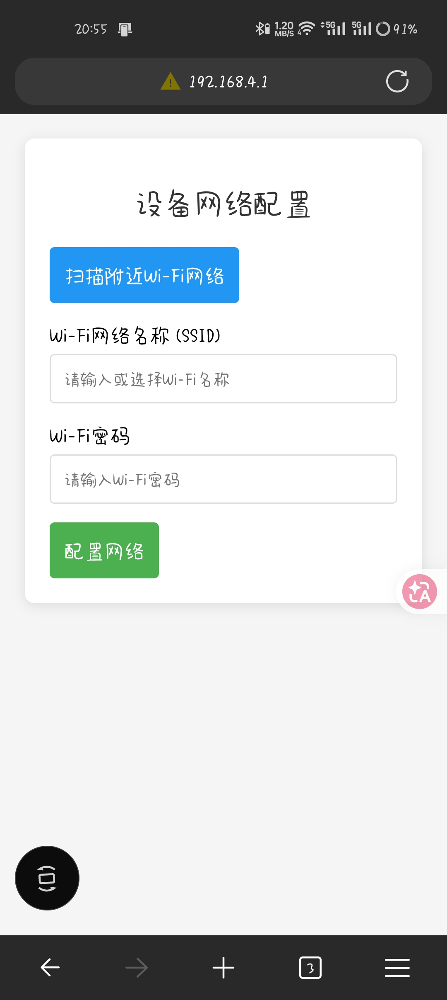

# 🏡 ESP32-S3 智能家居环境监测节点

**(Smart Home Sensor Hub)**

基于 **ESP32-S3 (N16R8)** 与 **ESP-IDF v5.4** 开发的工业级物联网（IoT）环境监测终端。

本项目采用了高内聚、低耦合的模块化四层架构，集成了本地 OLED 显示、无 App 网页配网、传感器数据融合采集以及低功耗电源管理，具备完整的“产品级”雏形。

## ✨ 核心特性与功能实现 (Features & Implementation)

### 🕸️ 1. 无 App 网页配网 (SoftAP WebConfig)

抛弃繁琐的第三方 App，利用内置 Web 服务器实现极简配网：

- **实现逻辑**：
  1. 设备上电开启 AP 模式，启动内部 Web 服务器，对外广播 `ESP32_Config` 热点（名称可自定义）。
  2. 手机连接热点后，浏览器访问 `http://192.168.4.1`。
  3. ESP32 将内置的 `apcfg.html` 页面发送至手机。
  4. 用户提交 WiFi 密码后，前端通过 **WebSocket** 将 JSON 格式的凭证发送给 ESP32。
  5. 连接成功后，自动切换为 **STA 模式**（降低功耗），并开始连接 MQTT 服务器。

> ⚠️ **硬件避坑指南**：如果使用 3.7V 锂电池直接通过 LDO 供电，当电量不足时与 3.3V 压差太小，可能导致瞬间电流不足以支撑开启 AP 热点。建议配网时保证电源充足。

### ☁️ 2. MQTT 稳定上云与心跳

- **自动上报**：配网成功后，设备自动采集温湿度及烟雾数据，每隔 **5秒** 通过 MQTT 推送至服务器，并伴随 LED 灯闪烁作为物理指示。
- **高可扩展性**：采用标准的 `cJSON` 格式打包。如需添加新传感器，只需编写驱动 (`.h`, `.c`) 并在主循环中更新 JSON 字段即可。对接阿里云、OneNET 或私有服务器均可完美兼容。

### 🌡️ 3. 多传感器并发采集

- **DHT11 (温湿度)**：加入 3 次容错重试机制，抵抗底层系统时序干扰。
- **MQ-2 (烟雾/可燃气体)**：基于 ESP-IDF v5 最新的 `adc_oneshot` 驱动，内置多次采样抗抖动算法，并将原始模拟量自动换算为直观的 PPM 浓度值。

### 🔋 4. 自动轻度休眠与 DTIM 优化 (低功耗)

开启 FreeRTOS 空闲任务运行时的 `Tickless Idle` 机制与 `Auto Light Sleep`。

- Wi-Fi 强制开启 Modem-sleep，并在配网后优化 DTIM 监听间隔。在保证 5 秒高频上报的同时，自动降低 CPU、RTC 和晶振运行频率，大幅减小发热与平均功耗。
- *注：由于 MQ-2 需要内部加热丝持续工作，难以实现极致的深度休眠响应。未来计划引入 MOS 管切断外设供电。*

### 📺 5. OLED 本地状态可视化

内嵌自定义 I2C OLED 驱动与多级字库（6x8 / 8x16），支持屏幕自适应排版：

- **开机引导**：提示操作步骤，显示需连接的 IP 地址 (`192.168.4.1`)。
- **配置反馈**：配网期间实时跳转并显示网络状态与调试信息。
- **本地监控**：轮询显示本地测量的温度、湿度、气体 PPM 浓度。

## 📂 软件架构 (Architecture)

代码采用严格的四层架构，彻底解耦硬件驱动与业务逻辑，极易进行二次开发与移植：

```
├── main/                   # 系统入口与应用层逻辑
│   ├── main.c              # NVS初始化、电源管理配置及各模块调度
│   ├── app_network.c       # MQTT 链路维护、IP 监听、数据打包上报
│   └── app_sensor.c        # 传感器采集任务与时序调度
├── components/BSP/         # 板级支持包 (硬件驱动层)
│   ├── DHT11/              # 单总线温湿度传感器驱动
│   ├── MQ2/                # ADC 气体传感器驱动及 PPM 换算
│   ├── OLED/               # I2C SSD1306 屏幕驱动与取模字库
│   ├── LED/                # 状态指示灯驱动
│   └── WebConfig/          # SoftAP 热点建网及 WebSocket 网页交互
└── CMakeLists.txt
```

## 🔌 硬件接线指南 (Wiring)

请根据以下引脚定义连接你的传感器和显示屏（以实际代码配置为准）：

| 模块设备         | ESP32-S3 引脚       | 备注说明                                                    |
| ---------------- | ------------------- | ----------------------------------------------------------- |
| **DHT11 (DATA)** | `GPIO 4`            | 建议在 DATA 引脚与 3.3V 间加上 4.7k 上拉电阻                |
| **MQ-2 (AO)**    | `GPIO 5` (ADC1_CH4) | 模拟输出端，用于采集气体浓度连续变化                        |
| **MQ-2 (VCC)**   | `5V`                | **注意**：5V供电发热量大，若采用电池建议增加 MOS 管控制电源 |
| **OLED (SDA)**   | `GPIO 17`           | I2C 数据线                                                  |
| **OLED (SCL)**   | `GPIO 18`           | I2C 时钟线                                                  |
| **OLED (VCC)**   | `3.3V`              | 严禁接 5V，防止烧毁 GPIO                                    |
| **RST 按键**     | `EN` -> `GND`       | 按键一：连接轻触按键到 GND，用于强制物理重启                |
| **Power 开关**   | 电源总线            | 按键二：物理拨码开关，用于彻底切断与电池的连接              |

## 🛠️ 编译与烧录 (Build & Flash)

### 1. 环境准备

本项目强依赖于 **ESP-IDF v5.5.4**（推荐 v5.0 或更高版本），MQ-2 驱动使用了全新的 `esp_adc/adc_oneshot.h` API。

### 2. Menuconfig 必选项配置

为了使低功耗模块正常工作，请务必在终端执行 `idf.py menuconfig`，并开启以下选项：

- `Component config` -> `Power Management` -> 勾选 **Support for power management**
- `Component config` -> `FreeRTOS` -> `Kernel` -> **configTICKLESS_IDLE** 设置为 `Enabled`

### 3. 编译与运行

```
idf.py set-target esp32s3
idf.py build
idf.py -p COMx flash monitor  # 将 COMx 替换为你的实际串口号
```

## 📱 使用说明 (Usage)

1. **设备上电**：屏幕将显示开机引导说明，随后开启名为 `ESP32_Config` 的开放 Wi-Fi 热点。
2. **手机配网**：
   - 手机连接 `ESP32_Config` 热点。
   - 浏览器访问 http://192.168.4.1。
   - 在弹出的网页中输入你家中的路由器账号密码并提交。
3. **状态监控**：OLED 屏幕将依次提示 `WiFi Connected!` -> `MQTT Connected!`。随后进入工作模式。
4. **云端数据**：设备将向 MQTT Topic 发送如下格式的 JSON 数据包（伴随 LED 闪烁）：

```
{
    "temp": 26.5,
    "humi": 55.0,
    "gas_ppm": 125.4
}
```

## 🚀 未来规划 (To-Do List)

- [ ] **NVS 持久化**：将配网网页传来的 Wi-Fi 凭证及 MQTT 服务器信息保存至 NVS Flash，实现掉电自动重连。

- [ ] **SmartConfig 配网**：增加微信/ ESP-Touch 兼容的一键配网功能，与 WebConfig 形成双冗余。

- [ ] **硬件电源隔离**：增加 GPIO 控制的 MOS 管电路，彻底切断 MQ-2 闲置状态下的供电以实现极致低功耗。

  <div align="center">

  # ap配网效果图
  **(Smart Home Sensor Hub)**

  

